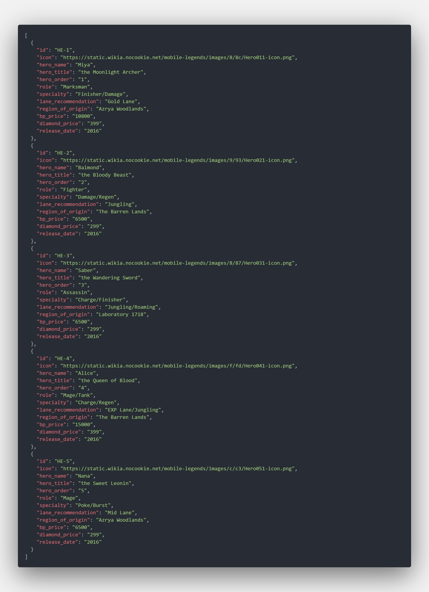
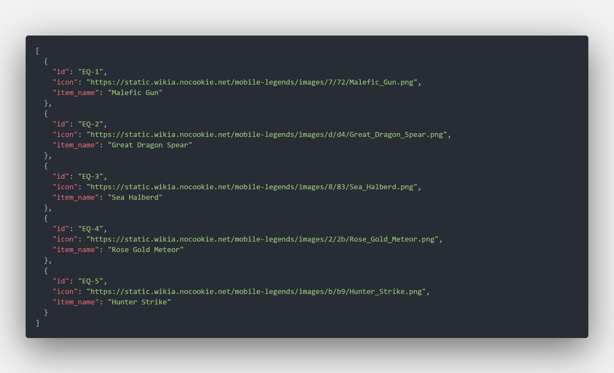
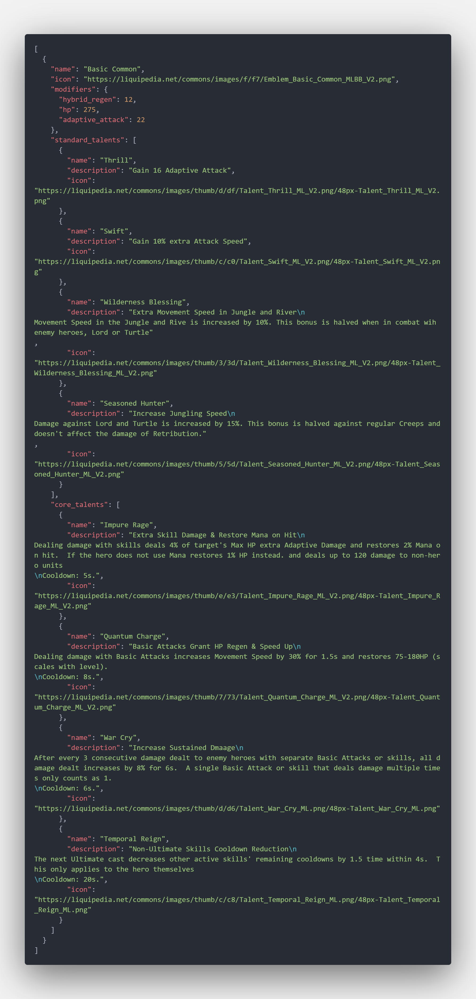

# MLBB Wiki Scraper
Tools to scrape web data from the MLBB Wiki and output it as a JSON file, currently the available data that can be scraped are:
- Heroes Data
- Equipment Data
- Emblem Data

This web scraping tool is mainly built using Puppeteer, you can check the documentation by [Clicking Here](https://pptr.dev/category/introduction)

## Resources
- [Puppeteer](https://www.npmjs.com/package/puppeteer)
- [P-Limit](https://www.npmjs.com/package/p-limit)

## Installation and Setup
1. Clone this repository
```sh
git clone https://github.com/ervin-sungkono/qr-code-gen.git
```
2. Install dependency
```sh
npm install
```
3. Run the app
```sh
npm start
```
4. All output files will show in the following directories:
- `/output` for all heroes, equipments, and emblems
- `/heroes` for each hero's detail
- `/equipment` for each equipment's detail

## Preview
### Hero List JSON Example

### Equipment List JSON Example

### Emblem List JSON Example
